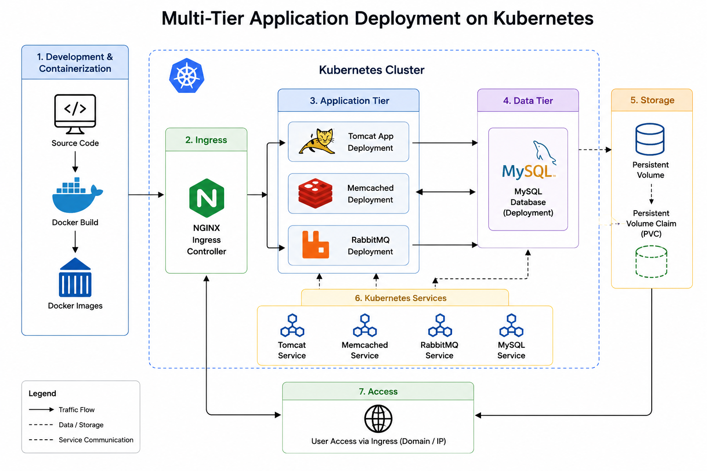

# 🚀 Multi-Tier Application Deployment on Kubernetes

Deploying a containerized multi-tier Java application on Kubernetes using Docker, Kubernetes manifests, Persistent Volumes, Services, Secrets, and Ingress.

---

# 📖 Project Overview

This project demonstrates the complete deployment lifecycle of a multi-tier application.

The application components were containerized using Docker and deployed on a Kubernetes cluster. Kubernetes resources such as Deployments, Services, Secrets, Persistent Volume Claims (PVC), and Ingress were configured to provide secure communication, persistent storage, and external access.

---

# 🏗️ Architecture

<p align="center">

</p>

---

# 🛠️ Tech Stack

| Category | Technologies |
|----------|--------------|
| Containerization | Docker |
| Orchestration | Kubernetes |
| Database | MySQL |
| Message Broker | RabbitMQ |
| Cache | Memcached |
| Application Server | Tomcat |
| Networking | Kubernetes Services, Ingress |
| Storage | Persistent Volume, PVC |

---

# ⚙️ Deployment Workflow

```text
Application Source
        │
        ▼
Dockerfiles
        │
        ▼
Docker Images
        │
        ▼
Docker Compose (Local Testing)
        │
        ▼
Kubernetes Cluster
        │
 ├── MySQL
 ├── RabbitMQ
 ├── Memcached
 ├── Tomcat
 ├── Secret
 ├── Persistent Volume Claim
 ├── Service
 └── Ingress
        │
        ▼
Application Access
```

---

# 📂 Project Components

| Component | Purpose |
|------------|----------|
| Dockerfile | Builds application containers |
| Docker Compose | Runs the application locally |
| Deployment | Creates application Pods |
| Service | Enables Pod communication |
| Secret | Stores sensitive credentials |
| Persistent Volume Claim | Provides persistent storage |
| Ingress | Exposes the application externally |
| MySQL | Database |
| RabbitMQ | Message Queue |
| Memcached | Caching Service |
| Tomcat | Hosts the application |

---

# ✨ Key Features

- Built Docker images for application components.
- Deployed a multi-tier application on Kubernetes.
- Configured Persistent Volume Claims for data persistence.
- Managed Secrets for secure configuration.
- Configured Services for internal communication.
- Exposed applications using Kubernetes Ingress.
- Deployed MySQL, RabbitMQ, Memcached, and Tomcat as Kubernetes workloads.

---

# 📸 Screenshots

- Docker Images
- Docker Compose
- Kubernetes Pods
- Services
- Persistent Volume Claim
- Ingress
- Application Running

---

# 📁 Repository Structure

```text
docker/
│
├── app/
├── db/
├── web/
└── docker-compose.yml

kubernetes/
│
├── deployment.yaml
├── service.yaml
├── ingress.yaml
├── pvc.yaml
├── secret.yaml
├── mysql.yaml
├── rabbitmq.yaml
├── memcached.yaml
└── tomcat.yaml
```

---

# 🎯 Learning Outcomes

- Built custom Docker images using Dockerfiles.
- Managed multi-container applications using Docker Compose.
- Deployed containerized workloads on Kubernetes.
- Configured networking using Kubernetes Services and Ingress.
- Managed persistent storage using Persistent Volume Claims.
- Deployed stateful and stateless services in Kubernetes.
- Improved understanding of Kubernetes resource management.

---

# 📜 License

MIT License